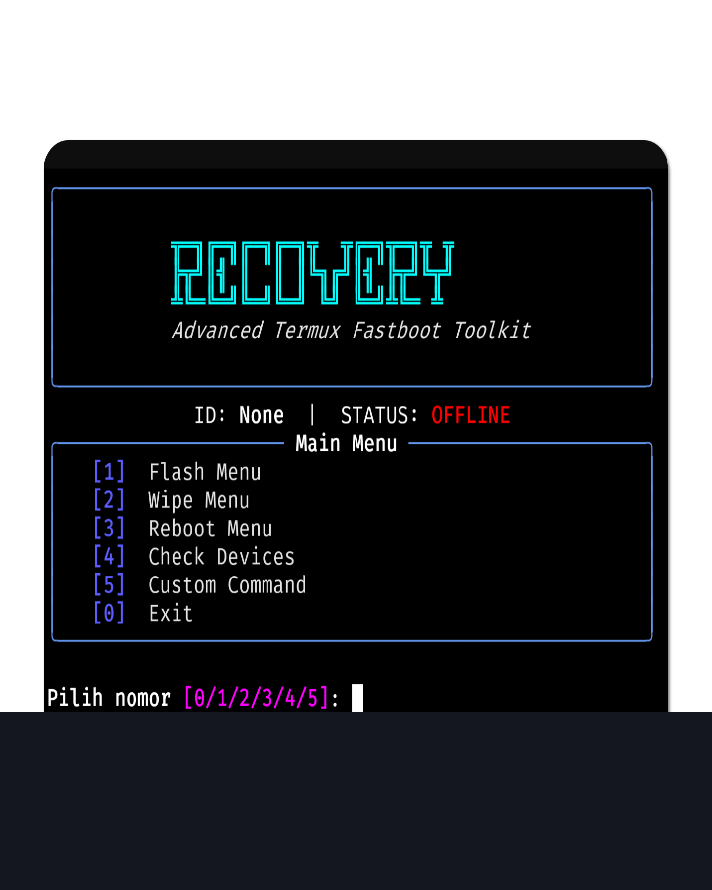

# 🛠️ Advanced Termux Fastboot Toolkit

[](https://www.python.org/)
[](https://termux.dev/)
[](https://opensource.org/licenses/MIT)

Toolkit berbasis Python yang dirancang khusus untuk pengguna **Termux** guna mempermudah proses flashing, wiping, dan manajemen perangkat Android dalam mode **Fastboot**. Dilengkapi dengan UI modern menggunakan library `rich`.

---

## 📸 Preview


---

## ✨ Fitur Utama

* **⚡ Smart Flashing:** Flash Partisi Recovery, Boot, Vendor, dan Init Boot dengan mudah.
* **🧹 Wipe Tool:** Hapus Userdata, Metadata, dan Cache secara instan.
* **🔄 Reboot Options:** Navigasi cepat ke System, Recovery, atau Bootloader.
* **💻 Custom Command:** Masukkan perintah fastboot manual tanpa keluar dari toolkit.
* **🎨 Rich UI:** Tampilan tabel, progress bar, dan status perangkat yang interaktif.
* **📂 File Manager Integration:** Terintegrasi dengan storage Android untuk memilih file `.img`.

---

## 📱 Tahap 1: Persiapan Aplikasi 

Sebelum mengetik perintah apa pun, pastikan aplikasi Termux kamu sudah siap.
> ⚠️ **PERINGATAN KERAS:** Jangan mengunduh Termux dari Google Play Store karena versinya sudah usang dan tidak lagi mendapat update.

* **Unduh Termux Utama:** [Download via F-Droid](https://f-droid.org/en/packages/com.termux/) atau [via GitHub Repo](https://github.com/termux/termux-app/releases).
* **Unduh Termux:API:** Aplikasi pendamping ini wajib diinstal agar Termux bisa membuka File Manager HP kamu. [Download via F-Droid](https://f-droid.org/en/packages/com.termux.api/) atau [via GitHub Repo](https://github.com/termux/termux-api/).

---

## 💻 Tahap 2: Konfigurasi Termux

Buka aplikasi Termux yang baru saja diinstal, lalu jalankan perintah ini satu per satu. Pastikan koneksi internet kamu stabil.

**1. Berikan Izin Penyimpanan Internal:**
```bash
termux-setup-storage

```
>*(Akan muncul popup di layar, klik **Allow / Izinkan**).*
**2. Update Sistem Termux Dasar:**
```bash
pkg update && pkg upgrade -y

```
## 📥 Tahap 3: Instalasi Toolkit
Salin dan tempel baris perintah berikut di terminal Termux kamu:
**1. Unduh (Clone) Repository Ini:**
```bash
git clone https://github.com/AWxXFX/Termux-Fastboot-Toolkit.git

```
**2. Masuk ke Folder Project:**
```bash
cd Termux-Fastboot-Toolkit

```
**3. Jalankan Installer Otomatis:**
```bash
bash install.sh

```
*(Script ini akan menginstal Python, Android Tools, library rich, dan membuatkan shortcut agar toolkit bisa dipanggil dari mana saja).*
## 🚀 Tahap 4: Menjalankan Toolkit
Jika instalasi berhasil, kamu tidak perlu lagi repot-repot mencari folder project. Buka toolkit ini kapan saja dengan mengetik perintah sakti ini di Termux:
```bash
fastboot-tk

```
## 🔌 Tahap 5: Hubungkan Perangkat & Eksekusi
Saat toolkit sudah terbuka dan berjalan, sekarang waktunya menghubungkan perangkat target untuk dieksekusi. Tool ini membutuhkan **Kabel OTG**.
**Cara Menghubungkan:**
 1. Matikan HP Target, lalu nyalakan ke mode **Fastboot / Bootloader** (biasanya dengan menahan tombol Power + Volume Bawah).
 2. Hubungkan HP Target ke HP kamu (yang sedang membuka Termux) menggunakan kabel USB dan adaptor **OTG**.
 3. Di dalam menu toolkit, pilih opsi **[4] Check Devices** untuk memastikan perangkat sudah terbaca.
**Penjelasan Struktur Menu:**
 1. **Flash Menu:** Pilih partisi target, lalu otomatis membuka File Manager untuk memilih file .img.
 2. **Wipe Menu:** Membersihkan partisi standar (Data, Cache, Metadata).
 3. **Reboot Menu:** Mengontrol perangkat target untuk menyala ulang ke System, Recovery, atau Bootloader.
 4. **Check Devices:** Verifikasi koneksi OTG.
 5. **Custom Command:** Fitur terminal di dalam terminal untuk perintah Fastboot spesifik.
## ⚠️ Peringatan (Disclaimer)
**Gunakan dengan risiko sendiri!** Tool ini melakukan modifikasi pada sistem Android tingkat rendah. Pastikan Anda memahami partisi apa yang Anda flash. Penulis tidak bertanggung jawab atas kerusakan perangkat (hardbrick), kehilangan data, bootloop, atau masalah apa pun yang disebabkan oleh penggunaan toolkit ini.
## 🤝 Kontribusi
Punya ide untuk fitur baru atau menemukan bug? Silakan buka **Issue** atau kirim **Pull Request**. Kontribusi dalam bentuk apa pun sangat dihargai!
**Dibuat dengan ❤️ untuk komunitas oprek Android Indonesia.**
